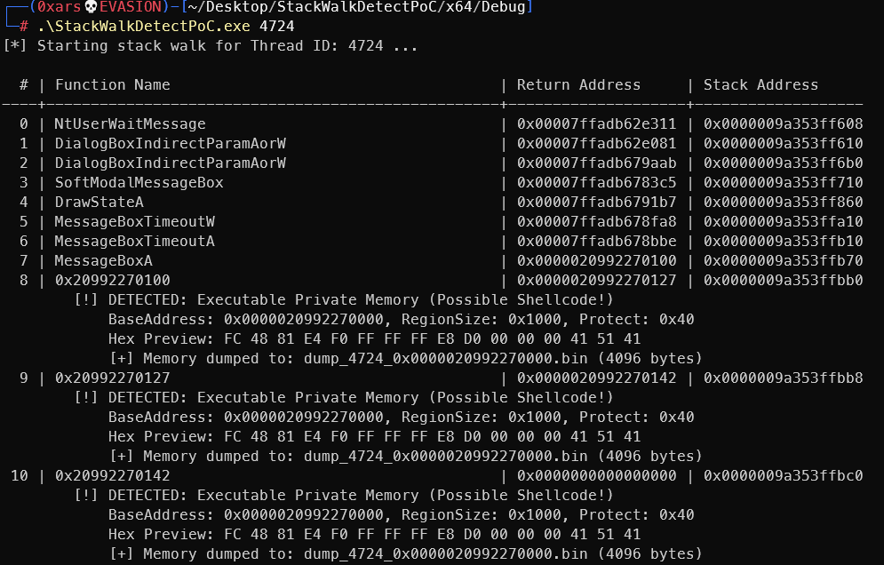
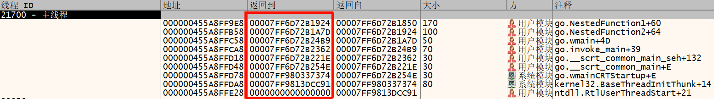
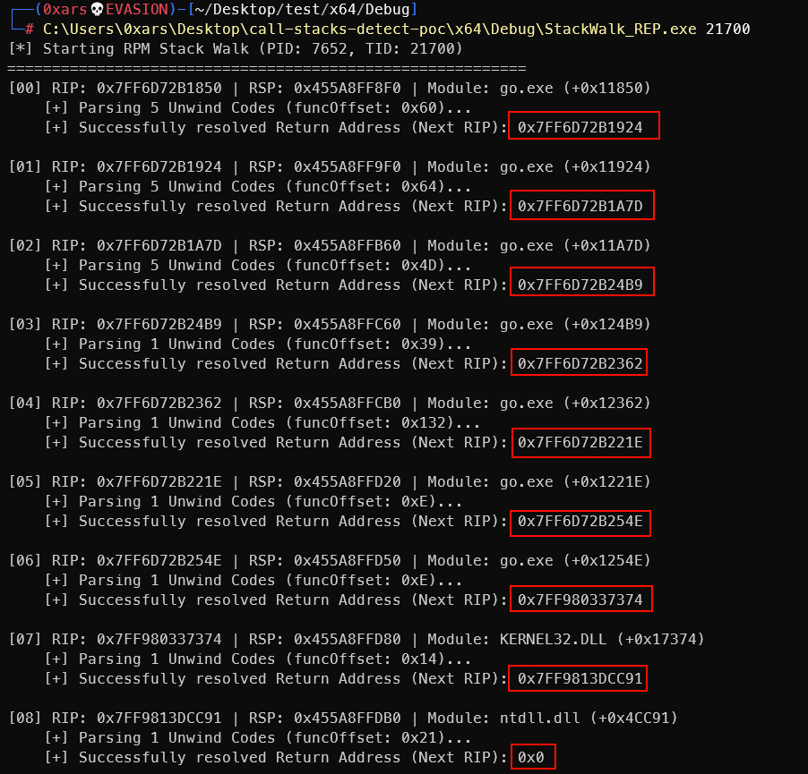

# StackWalkDetectPoC

一个简单PoC通过StackWalk64进行栈回溯，检测shellcode

**References**

- https://github.com/winsiderss/systeminformer
- https://www.elastic.co/security-labs/call-stacks-no-more-free-passes-for-malware

# StackWalk_REP

不使用[StackWalk64](https://learn.microsoft.com/en-us/windows/win32/api/dbghelp/nf-dbghelp-stackwalk64)，手动进行栈回溯。目的是为了学习`IMAGE_DIRECTORY_ENTRY_EXCEPTION`

> 不支持JIT情况

